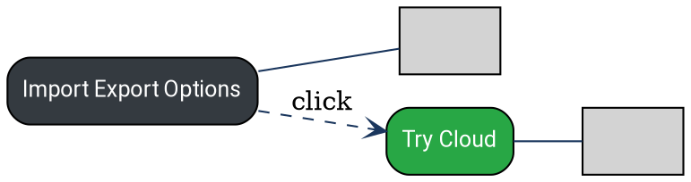

```yaml
title: 'Design Guide: DOT Files for Gantt GUI'
tags:
- gantt
- design
- dot
- graphviz
persona: kilo_extension
status: active
version: V00.01.00
updated: 2026-06-08
summary: 'Style guide for creating DOT files with image nodes for Gantt GUI.'
```

# Design Guide: DOT Files for Gantt GUI

> Version: V00.01.00

## Overview

This guide documents the styling conventions for Graphviz DOT files used in the Gantt GUI, particularly for flow diagrams with embedded images.

## Style Guide

### Color Palette

| Element | Color | Usage |
|---------|-------|-------|
| Primary Charcoal | `#343a40` | Main action buttons, primary nodes |
| Action Green | `#28a745` | Primary CTAs, positive actions |
| Background Gray | `#f8f9fa` | Node backgrounds |
| Border Gray | `#dee2e6` | Grid lines, borders |
| Dark Blue (Edges) | `#1a365d` | Arrow connections |

### Typography

- **Font Stack**: `Segoe UI, Roboto, Helvetica Neue`
- **Font Size**: 12px
- **Style**: Clean sans-serif

### Node Styles

#### Normal Text Nodes
```dot
nodeName [label="Label Text", fillcolor="#343a40", fontcolor="white", style="filled,rounded"];
```
- Use `style="filled,rounded"` for rounded corners
- No margin specified (uses default size)

#### Image Nodes
```dot
nodeName [label="", image="filename.png", style=filled, margin="8,8"];
```
- Use `style=filled` (no rounded corners to prevent image clipping)
- `margin="8,8"` provides spacing to prevent image overlap with edges
- `label=""` for empty label

### Edge Styles

```dot
source -> target [color="#1a365d", arrowhead=vee];
source -> target [label="click", style=dashed];
```

- Dark blue `#1a365d` for all edges
- `arrowhead=vee` for standard arrows
- `style=dashed` for action indicators

### Layout

- `rankdir=LR` - Left to right layout
- `shape=box` - Rectangular nodes

## Example



## Image Handling Notes

1. **Rounded Edges**: Normal nodes use `style="filled,rounded"`. Image nodes use `style=filled` (no rounding) to prevent image clipping.

2. **Arrow Connections**: Connect text nodes to text nodes. Use `arrowhead=none` for image connections to avoid arrow overlapping the image.


---

## Change History

| Version | Date | Author | Reason |
|---------|------|--------|--------|
| V00.02.00 | 2026-06-08 | ai(kilo laguna) | image node not bigger adapt |
| V00.01.00 | 2026-06-08 | ai(kilo laguna) | Initial design guide creation |